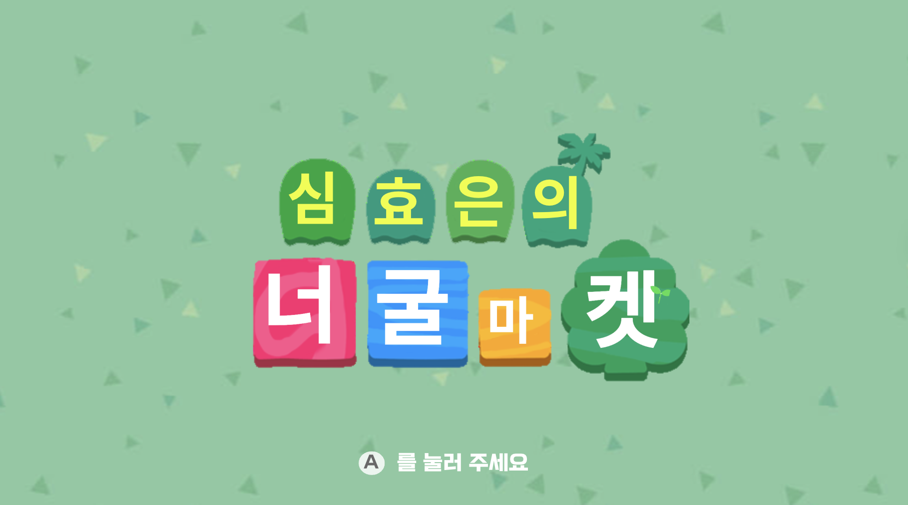
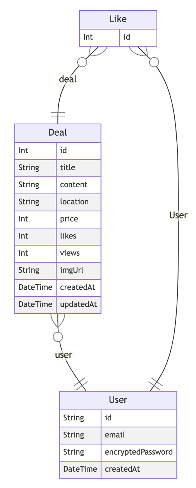

# 
너굴 마켓 : Server 🌿

## 🌿 목차

[1. 프로젝트 소개](https://github.com/haizellatte/neogul-market-server?tab=readme-ov-file#1-%ED%94%84%EB%A1%9C%EC%A0%9D%ED%8A%B8-%EC%86%8C%EA%B0%9C)  
[2. 서비스 소개](https://github.com/haizellatte/neogul-market-server?tab=readme-ov-file#2-%EC%84%9C%EB%B9%84%EC%8A%A4-%EC%86%8C%EA%B0%9C)  
[3. 기술 스택](https://github.com/haizellatte/neogul-market-server?tab=readme-ov-file#3-%EA%B8%B0%EC%88%A0-%EC%8A%A4%ED%83%9D)  
[4. ERD](https://github.com/haizellatte/neogul-market-server?tab=readme-ov-file#4-%EA%B5%AC%ED%98%84-%EA%B8%B0%EB%8A%A5)  
[5. 기능 구현](https://github.com/haizellatte/neogul-market-server?tab=readme-ov-file#4-%EA%B5%AC%ED%98%84-%EA%B8%B0%EB%8A%A5)  
[6. 회고 / 느낀점](https://github.com/haizellatte/neogul-market-server?tab=readme-ov-file#4-%EA%B5%AC%ED%98%84-%EA%B8%B0%EB%8A%A5)

 

## 1. 프로젝트 소개

유데미 X 사람인 풀스택 부트캠프에서 개인 과제로 진행한 **1인 프로젝트**입니다.  
• 총 제작 기간: 2024.03.27 - 2024.03.29 (3 day)

> 🔗 [발표 PPT](https://www.canva.com/design/DAF_a0H76nY/hAJ9HXTiwTIC9NB1jDGUyg/view?utm_content=DAF_a0H76nY&utm_campaign=designshare&utm_medium=link&utm_source=editor)
>
> 🔗 [Client Repository](https://github.com/haizellatte/neogul-market-client)

 

## 2. 서비스 소개

닌텐도의 "모여라 동물의 숲"은 유저가 처음 서비스를 시작할 때, 유저의 숲에 주민들이 랜덤으로 초대됩니다.  
이때 "내가 원하는 주민들을 내 숲에 초대하고, 다른 유저의 숲으로 보낼 수 있는 서비스가 있으면 좋겠다" 라는 생각에 해당 서비스를 만들게 되었습니다.

 

## 3. 기술 스택

- Typescript
- Nest.js
- Prisma
- AWS RDS

 

## 4. ERD

 

## 5. 기능 구현 
### 1. API 설계 및 개발
서버와 클라이언트 간의 통신을 위해 API를 설계하고 개발했습니다. 이 과정에서 URL 설계의 중요성, HTTP 메소드(GET, POST, PUT, DELETE)의 적절한 사용 방법 등을 배우며, 클라이언트 요청에 대해 서버가 어떻게 응답해야 하는지 배웠습니다.

### 2. 데이터베이스 관리 및 Prisma의 활용
Prisma ORM을 사용하여 데이터베이스를 관리했습니다.  Prisma는  Typescript 환경에서 데이터 모델링과 마이그이션을 보다 쉽게 작성할 수 있어 데이터베이스 스키마를 쉽게 정의하고, 데이터베이스와의 상호작용을 간결하고 안정적으로 처리할 수 있었습니다. 

### 3. 보안 측면의 중요성 인식
프론트엔드 개발자로서 시스템에 대한 보안 측면을 다뤄보면서, 웹 애플리케이션의 보안이 단순히 한 가지 측면에서만 고려되어야 하는 것이 아니라 개발의 모든 단계에서 우선적으로 고려되어야 하는 핵심 요소임을 이해하는 계기가 되었습니다. 

이를 위해 사용자 인증과 SQL Injection과 같은 공격으로부터 데이터베이스를 안전하게 보호하는 방법 등, 보안 취약점을 고려하여 개발하는 태도를 배웠습니다.

 

## 6. 회고 / 느낀점

이번 개인 프로젝트를 통해 `Nest.js`와 `Prisma` 그리고 `AWS RDS`를 활용해 처음으로 백엔드 서버를 개발 해보며 클라이언트와 서버 간의 상호작용과 통신 방식을 직접 설계하고 구현했습니다. 

특히 클라이언트가 보낸 요청을 처리하여 적절한 데이터를 응답하는 과정을 직접 구현하며 서버 개발의 즐거움을 느낄 수 있는 경험이었습니다.

